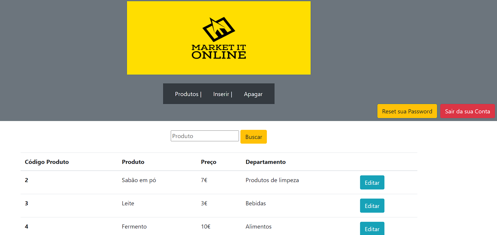
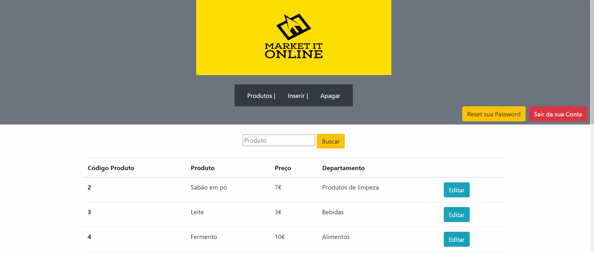
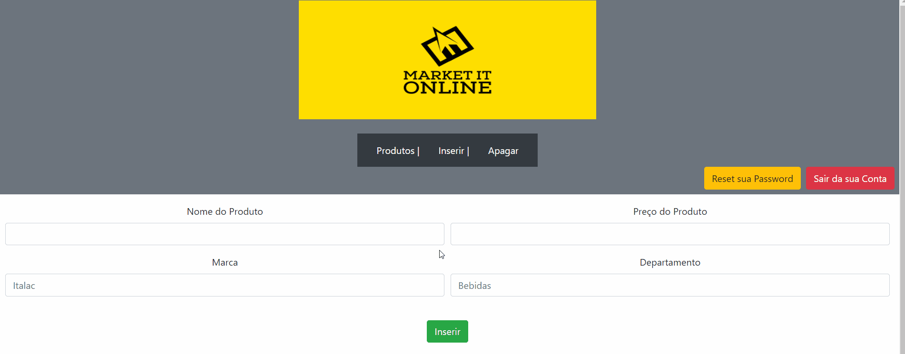
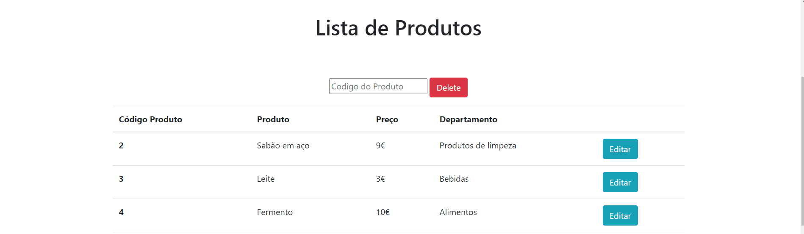
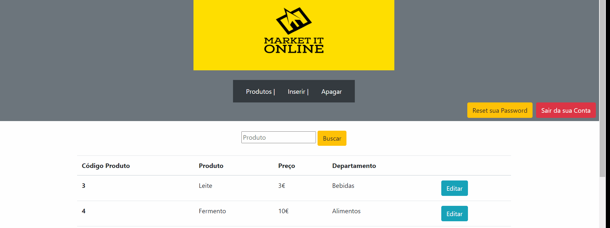

#  Dashboard of Products  
<a href="#tecnologies" >Tecnologies used</a> |&nbsp;
<a href="#edit" >Edit</a>&nbsp; |&nbsp; <a href="#insert" >Insert new product</a>&nbsp; |&nbsp; <a href="#delete" >Delete</a> &nbsp;|&nbsp; 
<a href="#search" >Search</a>

I created a dashboard for a store with functions to add, edit, delete and search specifically for a product.
 For storing product data, I used an SQL database. This database contains two tables, one for users and one for products.   

#  PHP PDO 
Using PHP PDO I performed data manipulation to generate rules for user identification, and verification if the user is logged in, until creating a user to access the dashboard, reset password and log out.
In addition to manipulating the data in PHP to receive information from the database and generate interactivity with the user.
To create the database and execute the code via "Apache", "Xampp" was used.
    
  
   
    
  
    

  ## # Edit
  

  
  

  ## # Insert new product
  

  

  ## # Delete
  

  

  ## #Search
  

  

# 

 🚀  Tecnologies 

- PHP version 7.4.7
- SQL 
- XAMPP
- HTML
- CSS
